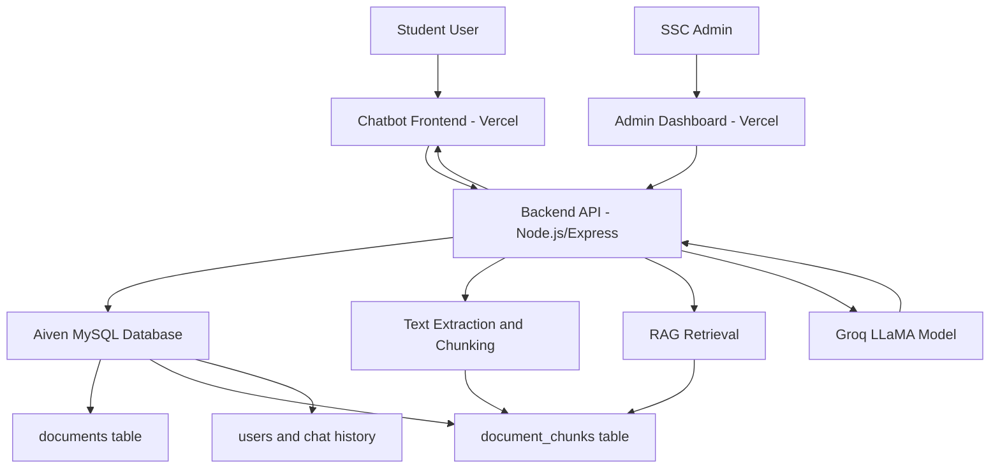

# SSC ChatBot

SSC-BOT is a fullstack AI-powered chatbot system designed to help students get Student Service Center (SSC) Telkom University Surabaya related information using natural language questions. 

Unlike traditional keyword-based bots, SSC-BOT uses AI and document-based retrieval so students can ask questions in different wording while still getting relevant answers. SSC-BOT is designed to improve the existing rule-based chatbot approach by combining a Large Language Model (LLM) with Retrieval-Augmented Generation (RAG). The system retrieves relevant information from SSC documents stored in the database, then uses the AI model to generate a natural and contextual answer.

## Problem Background

Currently, SSC already has a WhatsApp chatbot through the SSC hotline. However, this chatbot only works when the user asks questions using exact predefined words or patterns. If a student asks about a schedule but the wording is not exactly the same as the rule defined in the program, the chatbot may fail to answer.

This means the existing chatbot is still rule-based, using an if-then-else style logic, not a real AI-based chatbot. Because of this, many questions cannot be answered when users use different wording, even though the meaning is the same.

Another problem is that SSC information changes over time. Some information is completely new, such as Flexible Study Week, while some is an update to existing announcements or procedures. The chatbot must be able to answer using the most recent information. 

Because SSC staff are operational/admin users and not developers, they should not be required to edit code whenever there is a new announcement or updated information. A backend/admin dashboard is needed so staff can manage information operationally without editing source code.

## Proposed Solution Concept

SSC-BOT proposes an AI-based chatbot with an admin-managed knowledge base. 

The solution consists of:

1. **Student chatbot interface**
   - Students ask questions in natural language.
   - Questions do not need to exactly match predefined commands.
   - The chatbot retrieves relevant information and answers contextually.

2. **Admin dashboard for SSC staff**
   - Staff can upload PDF, DOCX, XLSX, and TXT documents.
   - Staff can update or delete outdated documents.
   - Staff can view extracted document content.
   - Staff can edit information pieces used by the chatbot.
   - Staff can test questions through the Query page.
   - Staff do not need to edit source code.

3. **Backend service**
   - Handles authentication, document processing, text extraction, chunking, embedding generation, and chatbot API requests.

4. **Database**
   - Stores users, documents, document chunks, embeddings, and chat history.
   - MySQL / Aiven MySQL is used as the main database.

5. **AI/RAG pipeline**
   - Uploaded documents are converted into text.
   - Text is split into information pieces/chunks.
   - Each chunk is embedded and stored.
   - When users ask a question, the backend searches relevant chunks.
   - The selected context is sent to the LLM.
   - The LLM generates an answer based on the retrieved information.

## System Architecture

**Frontend:**
- React + TypeScript + Vite + Tailwind CSS
- Provides chatbot UI and admin dashboard
- Deployed on Vercel

**Backend:**
- Node.js + Express + TypeScript
- Provides REST API
- Handles document upload, text extraction, chunking, embeddings, RAG retrieval, and AI response generation
- Can be run locally and exposed using ngrok for demo
- Can be deployed on Railway for hosted backend

**Database:**
- Aiven MySQL
- Stores documents, chunks, embeddings, users, and chat history

**AI:**
- Groq API with LLaMA model
- Used to generate chatbot responses based on retrieved document context



## How Information Updates Work

1. Admin logs in to the dashboard.
2. Admin uploads a new document or updates existing information.
3. Backend extracts text from the uploaded document.
4. Text is split into information pieces.
5. Embeddings are generated and stored in MySQL.
6. Chatbot can immediately retrieve the updated information.
7. If old information is deleted, chatbot will no longer use it.

This design solves the problem where staff previously would need developer help to change chatbot answers.

## Technical Development Approach

- Frontend built with React, TypeScript, Vite, Tailwind CSS.
- Backend built with Node.js, Express, TypeScript.
- MySQL used for structured storage.
- Aiven MySQL used for cloud database.
- Document upload handled by backend middleware.
- Text extraction supports PDF, DOCX, XLSX, and TXT.
- Documents are split into chunks.
- Embeddings are generated and stored in database.
- RAG service searches relevant chunks using similarity matching.
- Groq API is called to generate final natural language answer.
- Admin dashboard provides CRUD document management and query testing.

**Major Backend Responsibilities:**
- Authentication and Admin role authorization
- Document CRUD operations
- Text extraction and chunk management
- Embedding generation
- RAG retrieval
- Chat response generation
- Chat history persistence

## Deployment

The frontend is deployed on Vercel and can be accessed at:  
https://sscbot-ta.vercel.app

For backend deployment, there are two supported options:

1. **Local backend + ngrok**
   - Suitable for development, testing, and demo.
   - Backend runs locally on the developer machine.
   - ngrok exposes the local backend to the internet.
   - Vercel frontend uses the ngrok URL as `VITE_API_URL`.

2. **Railway backend + Aiven MySQL**
   - Suitable for hosted deployment.
   - Backend is deployed to Railway.
   - Database remains on Aiven MySQL.
   - Vercel frontend points to the Railway backend URL.

**Database:**  
Aiven MySQL is used to store documents, chunks, embeddings, users, and chat history.

## Demo Credentials

After opening the live frontend, users can log in using either the admin demo account or the regular user demo account depending on the feature they want to test.

| Role | Email | Password | Access |
|------|-------|----------|--------|
| Admin | `admin` | `admin123` | Admin dashboard, document management, sync, and query testing |
| User | `kelompok4@sscbot` | `kelompok4` | Student/user chatbot interface |

> Note: These credentials are intended for demo usage only. Do not use them as production credentials.

## Setup Project

### 1. Clone Repository
```bash
git clone https://github.com/Fikri248/sscbot-ta.git
cd sscbot-ta
```

### 2. Install Dependencies
Install dependencies for root, backend, and frontend:
```bash
npm install
npm install --prefix backend
npm install --prefix frontend
```
Or use the script:
```bash
npm run install:all
```

## Environment Variables

Create a `.env` file in the backend folder (`backend/.env`).

```env
PORT=5000
DB_MODE=aiven
AIVEN_DB_HOST=...
AIVEN_DB_PORT=...
AIVEN_DB_NAME=...
AIVEN_DB_USER=...
AIVEN_DB_PASSWORD=...
AIVEN_DB_SSL=true
JWT_SECRET=...
GROQ_API_KEY=...
```

**Frontend (`frontend/.env`):**
```env
VITE_API_URL=https://your-backend-url/api
VITE_BACKEND_URL=https://your-backend-url
```

*Note: The `.env` file should not be pushed to GitHub as it contains secret data.*

## Run Project

Run frontend and backend simultaneously from the root folder:
```bash
npm run dev
```

The server will run on:
- Backend: http://localhost:5000
- Frontend: http://localhost:5173

If port 5173 is already in use, Vite will automatically use another port like 5174.

## Build

**Build Frontend:**
```bash
cd frontend
npm run build
```

**Build Backend:**
```bash
cd backend
npm run build
```

## Backend API Endpoints (Quick Reference)

### Auth
```text
POST /api/auth/register
POST /api/auth/login
POST /api/auth/logout
GET  /api/auth/me
```

### Admin
```text
GET    /api/admins
POST   /api/admins
PUT    /api/admins/:id
DELETE /api/admins/:id
```

### Documents
```text
POST /api/documents/import-dataset
POST /api/documents/upload
GET  /api/documents
GET  /api/documents/:id
GET  /api/documents/chunks/all
GET  /api/documents/:id/chunks
DELETE /api/documents/:id
```

### Chat
```text
POST /api/chat/start
POST /api/chat/send
GET  /api/chat/users
GET  /api/chat/sessions/:user_id
GET  /api/chat/messages/:session_id
```

## Security Note

Groq API keys and JWT secrets must be stored in the `.env` file on the backend. Do not store actual API keys in the frontend, README, `.env.example`, or any other file pushed to GitHub.
